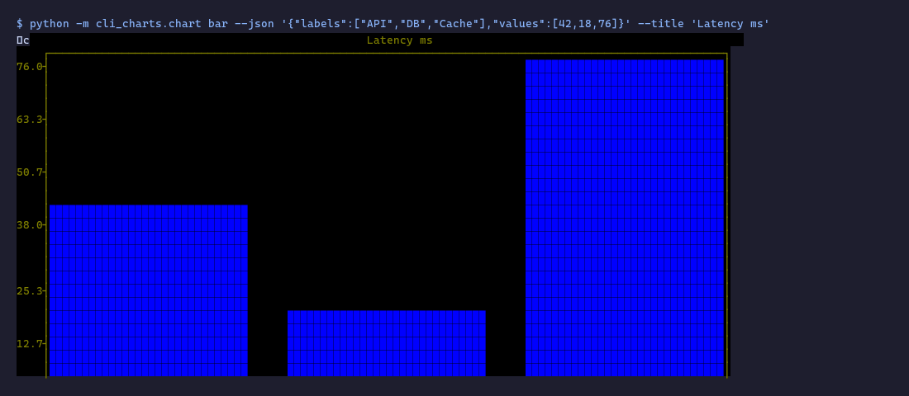

# glyph-arts

> When AI lives in the terminal, visualization must live there too.

All chart types rendered natively in the terminal -- no browser, no generated files, no context switch.
`pip install glyph-arts` and your AI agent has a native sense of sight inside the CLI.



---

## Install

```bash
pip install glyph-arts

# with LTTB downsampling (recommended for time-series):
pip install "glyph-arts[lttb]"

# with Textual TUI dashboard:
pip install "glyph-arts[tui]"

# everything:
pip install "glyph-arts[all]"
```

## See it in action

```bash
glyph-arts plot < data.csv  # auto-detect input format and chart type
glyph-arts plot --file metrics.json --title "Metrics"
glyph-arts plot --as scatter < points.tsv
glyph-arts spectrum --file examples/sdr/spectrum.json --title RF-Spectrum
glyph-arts waterfall --file examples/sdr/waterfall.json --title RF-Waterfall
glyph-arts demo              # 30s auto reel
glyph-arts demo --speed fast # 10s for impatient viewers
glyph-arts gallery           # browse 25 renderable charts interactively
glyph-arts gallery --output gallery.html  # static HTML demo
```


<!-- TODO: record actual demo.gif via asciinema/agg, see
     docs/recording-demo.md (P13). -->

## System dependencies (image / video charts only)

The `image` and `video` chart types shell out to `chafa` and `ffmpeg`.
Install them once before using those types:

| OS | Command |
|---|---|
| Windows | `scoop install chafa ffmpeg` or `choco install chafa ffmpeg` |
| macOS | `brew install chafa ffmpeg` |
| Linux (Debian/Ubuntu) | `apt install chafa ffmpeg` |
| Linux (Homebrew) | `brew install chafa ffmpeg` |

For chat-window image previews, `glyph-arts image --file avatar.jpg --fit subject
--symbols braille --no-color --filter anime` trims background, sharpens line
art, and renders pure monospace symbols.
Use `--filter ink` for white-page material such as formulas, scans, and
documents; it inverts the page so dark terminal backgrounds show ink instead
of paper.
If formula source is available, prefer text rendering:
`echo "\int exp(-x^2) dx = \sqrt{\pi}" | glyph-arts chat formula`.
For multi-line terminal math layout, use SymPy-backed pretty rendering:
`echo "(a+b)/(c+d)" | glyph-arts chat formula-pretty`.

Use `--preset chat`, `--preset chat-hd`, `--preset chat-max`, or `--preset chat-4k`
for the same pipeline at 72x36, 96x48, 120x60, or 132x66 terminal cells.
For terminal panes such as Warp, use `--preset terminal`; add `--cols N` when
the subprocess cannot read the real pane width.
On Windows Terminal, ConPTY usually reports columns correctly when attached to
the terminal; if a runner/capture layer reports 80, use `--cols N` or set
`GLYPH_ARTS_COLS=N`.
Agents should prefer `glyph-arts image --file avatar.jpg --preset terminal` for
terminal conversations; fixed presets are for portable screenshots or narrow
chat surfaces.
Run `glyph-arts chat calibrate` to print ASCII and braille width rulers for
measuring the current chat window before choosing a preset.
If the target is a real terminal, `glyph-arts chat calibrate --terminal` reads
the current terminal column count and prints rulers around that width.
For wide windows, use
`glyph-arts chat calibrate --calibrate-from 160 --calibrate-to 240 --calibrate-step 8 --calibrate-glyph braille --recommend`.

All other chart types are pure-Python and work after `pip install glyph-arts` alone.

## Art tiers (--engine pixel)

The pixel engine renders charts via matplotlib + chafa. The chafa
output character set controls visual fidelity:

| Tier | Flag | Symbol set | Resolution | Font requirement |
|---|---|---|---|---|
| Low | `--art low` | block | 1x1 px/char | Universal (any terminal) |
| Default | `--art default` | vhalf | 1x2 px/char | Universal (Block element) |
| High | `--art high` | sextant | 2x3 px/char | Needs Symbols-for-Legacy-Computing font (Cascadia Code OK) |

Default is `--art default` -- btop-like aesthetic, broad terminal compat.


## Output formats

`--output PATH` chooses the export format from the file suffix:

| Suffix | Engine | Result |
|---|---|---|
| `.png` | `--engine pixel` | Existing matplotlib PNG file output |
| `.txt` | default ASCII | Rendered chart text with ANSI escapes stripped |
| `.ansi` | default ASCII | Rendered chart text with ANSI escapes preserved |
| `.html` | default ASCII | `<pre>` snippet with ANSI foreground colors converted to inline spans |
| `.md` | `table` | GitHub-Flavored Markdown table |

```bash
glyph-arts bar --json '{"labels":["A","B"],"values":[1,2]}' --output chart.txt
glyph-arts bar --json '{"labels":["A","B"],"values":[1,2]}' --output chart.ansi
glyph-arts bar --json '{"labels":["A","B"],"values":[1,2]}' --output chart.html
glyph-arts bar --engine pixel --json '{"labels":["A","B"],"values":[1,2]}' --output chart.png
glyph-arts table --json '{"columns":["A","B"],"rows":[["x","1"]]}' --output table.md
```

## Claude Code CLI compatible

glyph-arts includes Claude Code terminal compatibility flags for statuslines,
themes, hyperlinks, and markdown rendering:

```bash
glyph-arts sparkline --json '[1,2,3,4,5,6,7,8,9,10]' --statusline
glyph-arts line --theme claude-dark-ansi --json '[{"label":"X","x":[1,2,3],"y":[10,20,15]}]'
glyph-arts line --title Docs --link-title https://docs.anthropic.com --json '[{"label":"X","y":[1,2,3]}]'
glyph-arts scatter --link-data https://example.com/point --json '[{"label":"A","x":[1,2],"y":[3,4]}]'
glyph-arts line --theme subagent-rainbow --json '[{"label":"A","y":[1,2]},{"label":"B","y":[2,1]}]'
```

- `--theme claude-dark-ansi` and `--theme claude-light-ansi` read
  `~/.claude/themes/{dark,light}-ansi.json` when present, with a 16-color ANSI
  fallback.
- `--theme subagent-rainbow` uses the Claude Code subagent named colors:
  red, blue, green, yellow, purple, orange, pink, cyan.
- `--statusline` on `sparkline`, `indicator`, and `gauge` emits one line,
  capped at 80 chars, suitable for `~/.claude/settings.json` `statusLine.command`.
- `--link-title` and `--link-data` opt into OSC 8 hyperlinks. If the terminal
  capability is not detected, output falls back to `label (url)`.
- `table --output *.md` writes a GFM table for Claude Code markdown rendering.

## Animation

`animate` redraws an ASCII chart in-place using a cursor-home loop. MVP support:
`line`, `bar`, `scatter`, and `sparkline`.

```bash
glyph-arts animate line --duration 5 --frames 30 \
  --json '[{"label":"DAU","x":[1,2,3,4,5,6,7,8,9,10],"y":[100,120,115,130,125,140,135,150,145,160]}]'
```

Ctrl-C exits cleanly and leaves the complete final chart on screen.

## Recording

`record` and `record-replay` wrap optional system tools for terminal session
capture and replay export. Install only the tools for the formats you need:

| Tool | Used for | Windows install |
|---|---|---|
| `asciinema` | `.cast` recording | `scoop install asciinema` or `choco install asciinema` or `pip install asciinema` |
| `agg` | `.cast` to `.gif` | `scoop install agg` or `cargo install --git https://github.com/asciinema/agg` |
| `svg-term` | `.cast` to `.svg` | `npm install -g svg-term-cli` |

```bash
glyph-arts record demo.cast --cmd 'glyph-arts art "DEMO" --gradient sunset' --duration 10
glyph-arts record-replay demo.cast --output demo.gif
glyph-arts record-replay demo.cast --output demo.svg
glyph-arts record-replay demo.cast --output demo.html
glyph-arts record-replay demo.cast --output demo.cast
```

Missing tools fail with `ERROR:dep:` and an OS-specific install hint.

## HyperFrames Integration

`to-hyperframes` generates a progressive line-chart PNG sequence plus
`manifest.json` and `composition.html` for HyperFrames. HyperFrames is not a
Python dependency; install and render it separately:

```bash
npx hyperframes init

glyph-arts to-hyperframes \
  --json '[{"label":"x","x":[1,2,3,4,5],"y":[10,20,15,30,25]}]' \
  --frames 30 \
  --duration 5 \
  --output-dir ./hf-demo

# Then render with HyperFrames, for example:
npx hyperframes render ./hf-demo/composition.html
```

The output directory contains `frame_001.png` through `frame_NNN.png`,
`manifest.json`, and `composition.html`. Each frame reveals a larger slice of
the input series.

## Phase 8: ASCII Motion integration

glyph-arts can use ascii-motion-mcp as a stdio MCP backend to polish rendered ASCII charts with palette remapping and levels, then export animated output formats such as HTML, MP4, GIF, React, and SVG while also saving an editable `.asciimtn` project. Install both sides first:

```bash
pip install "glyph-arts[ai-motion]"
npm i -g ascii-motion-mcp

glyph-arts bar --json '{"labels":["A","B"],"values":[1,2]}' --polish ascii-motion --polish-style retro --output chart.html
glyph-arts to-ascii-motion bar --json '{"labels":["A","B"],"values":[1,2]}' --formats html,mp4,svg --output-dir ./out
```

## Art command (Phase 2)

The `art` command renders composable terminal text art: figlet font,
optional art-lib decoration, optional Rich frame, and optional ANSI gradient.
Install the opt-in extra first:

```bash
pip install "glyph-arts[art]"

glyph-arts art SHIP IT --font slant --decor barcode --frame double --gradient sunset
glyph-arts art GLYPH-ARTS --font big --frame rounded --gradient viridis --no-color
```

Use `--output PATH` to write the rendered text to a file. `--no-color` strips
ANSI color and ignores gradients.

## Quick start

```bash
# bar chart
glyph-arts bar --json '{"labels":["Q1","Q2","Q3"],"values":[10,14,12]}' --title "Revenue"

# time series
glyph-arts line \
  --json '[{"label":"DAU","x":[1,2,3,4,5],"y":[100,120,115,130,125]}]' \
  --title "Daily Active Users"

# pie chart
glyph-arts pie \
  --json '{"labels":["Equity","Bond","Cash"],"values":[60,30,10]}' \
  --title "Asset Allocation"

# python -m also works:
python -m cli_charts bar --json '{"labels":["A","B"],"values":[3,7]}'

# check core dependencies:
glyph-arts --check-deps
# include optional extras (braille/lttb/tui):
glyph-arts --check-deps --all
```

## Chart types

| Engine | Types |
|--------|-------|
| plotext | `kline` `candlestick` `line` `scatter` `step` `bar` `multibar` `stackedbar` `hist` `heatmap` `box` `indicator` `event` `confusion` |
| sdr | `spectrum` `waterfall` |
| rich | `table` `tree` `panel` `gauge` `pie` `dashboard` `rich_live` |
| drawille *(optional `[braille]`)* | `curve` `hires` `radar` |
| plotille | `plotille` |
| uniplot | `uniplot` |
| misc | `plot` `graph` `sparkline` `banner` `art` `animate` `record` `record-replay` `to-hyperframes` `to-ascii-motion` `chat` |
| media *(requires chafa + ffmpeg)* | `image` `video` |

Total: **56 types**. See `CHART_TYPE_COUNT` in `cli_charts/chart.py` for the authoritative count.

## SDR plots

`spectrum` and `waterfall` cover SDR-style terminal visualization without
owning SDR hardware, drivers, or demodulation. Feed them FFT/spectrogram output
from sdrrat, GNU Radio, SoapySDR, or a Python script. Both commands accept JSON,
JSONL/NDJSON, CSV, or TSV through `--format`, and `plot` auto-detects SDR-shaped
input.

```bash
glyph-arts spectrum --file examples/sdr/spectrum.json --title RF-Spectrum
glyph-arts waterfall --file examples/sdr/waterfall.json --title RF-Waterfall
glyph-arts spectrum --format csv < examples/sdr/spectrum.csv
glyph-arts waterfall --format csv < examples/sdr/waterfall.csv
glyph-arts plot < examples/sdr/spectrum.csv
```

Supported SDR overlays: `center`/`center_freq`, `bandwidth`/`span`, `vfo` or
`vfos`, `markers`, `signals`, `peaks`, `avg`, `max_hold`, `noise_floor`, and
`squelch`. Waterfall uses ANSI intensity colors by default; add `--no-color` for
plain logs, or `--font-tier ascii` for strict ASCII terminals.

Spectrum output:

```text
                               RF-Spectrum
       ◆ hold  + avg  · live
       ┌──────────────────────────────────────────────────────────────────┐
    -35│                      ┆       ◆◆▲◆       ┃ ┆                      │
       │                      ┆    ◆◆◆··│·◆◆◆    ┃ ┆                      │
       │                      ┆  ◆◆···++│+···◆◆  ┃ ┆                      │
       │                      ┆◆◆··+++  │   +··◆◆┃ ┆                      │
       │══════════════════════◆··+══════│══════··┃◆═══════════════════════│
    -64│                    ◆··+        │        ┃·◆◆                     │
       │                  ···+┆         │        ┃ ··◆◆◆                  │
       │              ····++  ┆         │        ┃ ┆ ···◆◆◆◆              │
       │         ·····++++    ┆         │        ┃ ┆    ····◆◆◆◆◆◆        │
       │◆◆◆······+++++╌╌╌╌╌╌╌╌╌╌╌╌╌╌╌╌╌╌│╌╌╌╌╌╌╌╌┃╌╌╌╌╌╌╌╌╌╌···········╌╌╌│
    -93│···                   ┆         │        ┃ ┆                   ···│
       └──────────────────────────────────────────────────────────────────┘
        99                                                            99.6
        center=99.3 bw=0.2 rx=99.38 FM@99.3
```

Waterfall output:

```text
                               RF-Waterfall
 t-5           ..........----------##########==========::::::::::.........
 t-4 ....................==========@@@@@@@@@@++++++++++::::::::::.........
 t-3 ....................----------%%%%%%%%%%**********::::::::::.........
 t-2           ..........::::::::::**********%%%%%%%%%%==========.........
 t-1           ..........::::::::::++++++++++@@@@@@@@@@++++++++++.........
 now           ....................==========##########%%%%%%%%%%:::::::::
     99.0                                                             99.6
range -94..-42 dB
 tune center=99.3 bw=0.2 rx=99.5
```

## All flags

```
glyph-arts <type> [--json JSON | --file PATH | --duckdb SQL --db PATH]
                  [--title TEXT] [--width N] [--height N] [--theme THEME]
                  [--sample N] [--xlabel X] [--ylabel Y]
                  [--xlim MIN MAX] [--ylim MIN MAX]
                  [--xscale linear|log] [--yscale linear|log]
                  [--orientation vertical|horizontal] [--format auto|json|jsonl|csv|tsv]
                  [--output FILE] [--no-color]
```

**Width** defaults to `$COLUMNS` (terminal width). Override with `--width 120`.

**`--sample N`** uses LTTB (Largest-Triangle-Three-Buckets) downsampling — shape-preserving, not random stride. Falls back to uniform stride if `lttb` not installed.

## Pipe / file input

```bash
# auto-detect JSON, JSONL/NDJSON, CSV, or TSV and pick a chart
cat metrics.csv | glyph-arts plot --title "Benchmark"
glyph-arts plot --file metrics.json
glyph-arts plot --as bar --file metrics.tsv

# stdin pipe (for large data)
cat metrics.json | glyph-arts bar --title "Benchmark"

# file (use with --sample for large datasets)
glyph-arts scatter --file ./data/million_points.json --sample 5000 --title "Correlation"
```

## DuckDB integration

```bash
glyph-arts kline \
  --duckdb "SELECT trade_date,open,high,low,close FROM stock_daily WHERE ts_code='600519.SH' ORDER BY trade_date DESC LIMIT 60" \
  --db /path/to/data.duckdb \
  --title "Kweichow Moutai K-line"
```

| Chart type | Column mapping |
|-----------|----------------|
| kline / candlestick | col0=date, open/high/low/close by name |
| line / scatter / step / uniplot | col0=x, col1..N=y series |
| bar / pie | col0=labels, col1=values |
| table | all columns as-is |
| hist | all columns as value series |
| heatmap | matrix from .values, col names as xlabels |
| curve | col0=x, col1=y |
| sparkline | col0 values |
| confusion | col0=actual, col1=predicted |
| graph | col0=src, col1=dst (edge list) |

## Dashboard

```bash
# interactive Textual TUI:
python -m cli_charts.dashboard --demo

# Rich static (pipe-safe, no textual required):
python -m cli_charts.dashboard --demo --no-interactive

# custom panels:
glyph-arts dashboard --json '{
  "panels": [
    {"type":"gauge","data":[{"label":"CPU","value":73,"max":100}],"title":"CPU"},
    {"type":"sparkline","data":{"values":[1,3,5,2,8,4,6]},"title":"Load"},
    {"type":"table","data":{"columns":["Host","Status"],"rows":[["web-01","OK"]]},"title":"Services"}
  ]
}' --title "System Health"
```

## Exit codes

| Code | Meaning |
|------|---------|
| 0 | Success |
| 1 | Bad input (JSON parse error or missing key) — `ERROR:json:` / `ERROR:schema:` on stderr |
| 2 | Missing dependency — `ERROR:dep: pip install <pkg>` on stderr |
| 4 | Render failed — `ERROR:render: <traceback last line>` on stderr |

## For Claude Code / AI agents

See [SKILL.md](SKILL.md) for the full AI usage contract: decision tree, schema reference, DO/DO NOT rules, and anti-patterns.

```bash
# Claude Code skill (no pip required — uses scripts/ shims):
SKILL=~/.claude/skills/glyph-arts
python $SKILL/scripts/chart.py bar \
  --json '{"labels":["A","B","C"],"values":[3,7,5]}' \
  --title "Example"
```

## Environment variables

| Variable | Effect |
|----------|--------|
| `CLI_CHARTS_LOG=1` | Append render history to `.chart_history.jsonl` |
| `NO_COLOR` | Disable ANSI colors (https://no-color.org) |

## License

MIT
